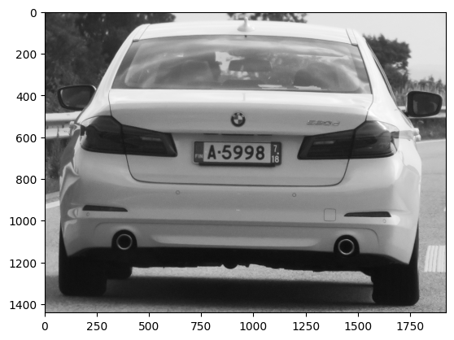
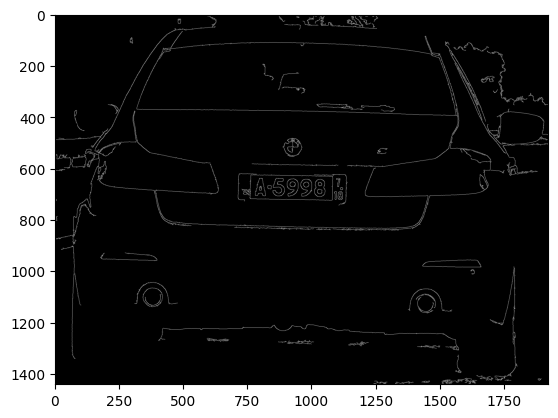
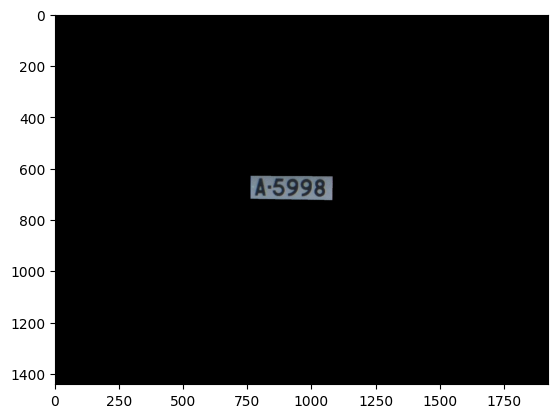
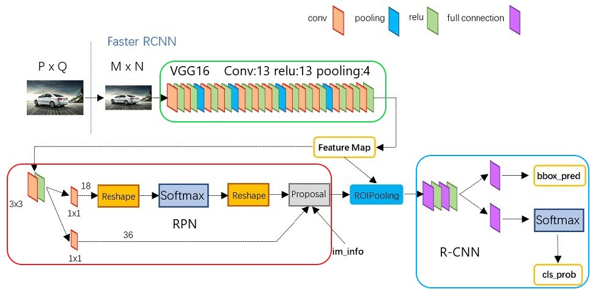
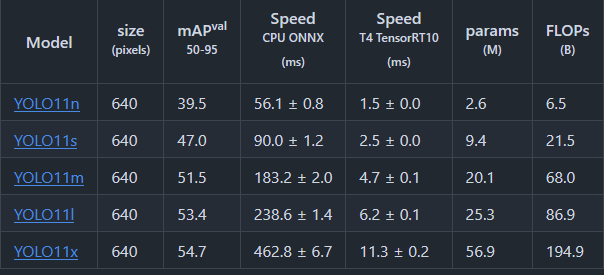
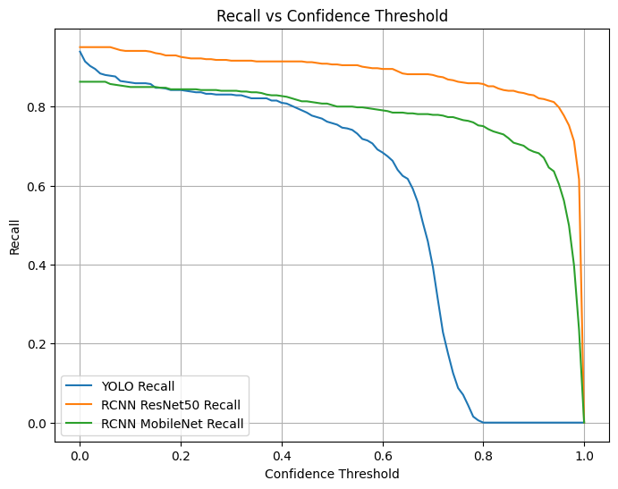
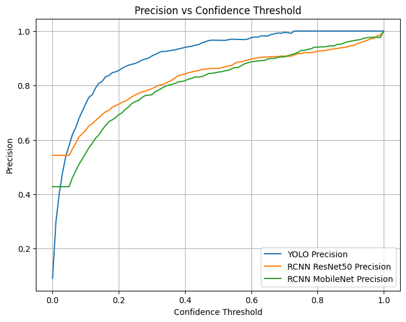
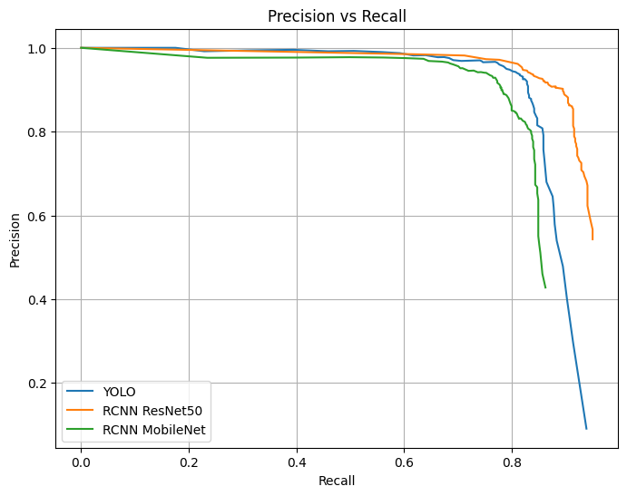
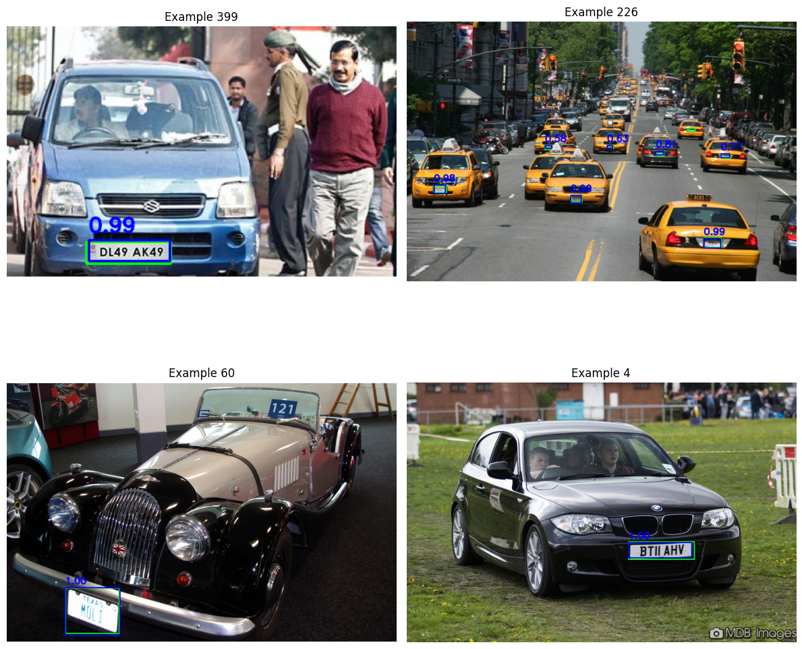
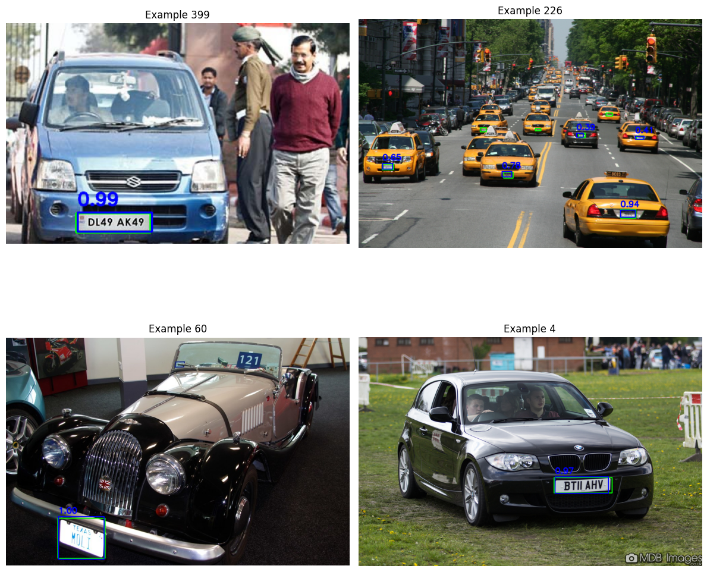

# License Plate Recognition
**Group Members: Eric Jonas**

*The poster presentation is available in [poster_presentation.pdf](poster_presentation.pdf).*

## Table of Contents
- [License Plate Recognition](#license-plate-recognition)
  - [Table of Contents](#table-of-contents)
  - [Problem](#problem)
  - [Related Work](#related-work)
  - [Data](#data)
    - [Large Dataset](#large-dataset)
    - [Small Dataset](#small-dataset)
    - [Merged Dataset](#merged-dataset)
  - [Implementation](#implementation)
    - [Object Detection](#object-detection)
      - [Edge Detection](#edge-detection)
      - [Faster R-CNN](#faster-r-cnn)
      - [YOLO](#yolo)
      - [DETR](#detr)
    - [Object Tracking](#object-tracking)
    - [OCR](#ocr)
  - [Evaluation](#evaluation)
    - [Object Detection](#object-detection-1)
      - [Metrics](#metrics)
      - [Model Comparison](#model-comparison)
    - [Video Demonstration](#video-demonstration)
  - [Conclusion](#conclusion)


## Problem
The ability to recognize vehicle license plates offers significant advantages across various domains, such as traffic management, parking automation and law enforcement. This project aims to develop a system capable of detecting and recognizing license plates in images and videos. The system will create bounding boxes around the plates and extract the license plate numbers from designated areas of interest.

Instead of detecting vehicles, the system directly tracks license plates. Tracking algorithms are used to associate the same license plate with a single object across multiple frames.  

Since license plate recognition or tracking systems have been implemented many times before, the goal of the project is not to build the system itself but rather to experiment with different algorithms for constructing it and compare their performance.


## Related Work
Automatic license plate recognition (ALPR) has been explored in several existing systems, such as OpenALPR. These systems have successfully been deployed in various settings, including parking facilities and highways, showcasing their potential for enhancing vehicle monitoring and control. 
There are numerous videos on YouTube and various websites showcasing how to build an Automatic License Plate Recognition (ALPR) system.

However, many of these videos do not discuss the differences between algorithms or compare them. To choose the optimal algorithm, one must first define requirements, for example, whether the system needs to operate in real-time or not. A good starting point for finding suitable object detection models was the [Papers with Code](https://paperswithcode.com/sota/object-detection-on-coco) Benchmark, which provides an overview of the top-performing models over the years. Additionally, [this paper](https://www.sciencedirect.com/science/article/pii/S095219762400616X) was particularly helpful in understanding and evaluating different object detection methods, guiding my decision on which approaches to experiment with.  

This led to the goal of testing license plate object detection using multiple models, starting with Faster R-CNNs, comparing them with the latest YOLO model (YOLOv11) and also implementing an detection transformer (DETR).  

Beyond object detection, the project also involves an OCR and an object tracking task. Various research papers explore image preprocessing techniques for achieving optimal OCR results, such as this one specifically for license plates: [Comparison of Image Preprocessing Techniques for Vehicle License Plate Recognition Using OCR: Performance and Accuracy Evaluation](https://arxiv.org/abs/2410.13622). However, we chose to stick with EasyOCR and grayscale images, despite this paper indicating a slight decline in performance when using EasyOCR with grayscale images.

For object tracking, **DeepSORT** was chosen over more advanced models. The decision was based on specific trade-offs, such as easy integration from existing libraries. Many state-of-the-art models listed in this [benchmark](https://paperswithcode.com/sota/multi-object-tracking-on-mot17) build upon DeepSORT (like StrongSORT), enhancing it in some aspects rather than replacing it entirely.  

The goal of this project is **not** to build the best system using the best algorithms from every field. Instead, it focuses on implementing a functional system and evaluating various object tracking algorithms.


## Data
The models were trained using data from the following sources:
- **[Kaggle Large Dataset](https://www.kaggle.com/datasets/fareselmenshawii/large-license-plate-dataset/code)**
  - **Training Set**: This subset contains 25,500 carefully curated images for model training.
  - **Validation Set**: Comprising 1,000 images, this subset is used for evaluating model performance during the development process.
  - **Test Set**: The test set includes 400 images, which are reserved for final model evaluation after training.

- **[Kaggle Small Dataset](https://www.kaggle.com/datasets/andrewmvd/car-plate-detection?select=images)**
  - This dataset includes 433 high-quality images.


### Large Dataset
The **large dataset** was created by merging images from various sources, including websites and other datasets, into a single expansive collection. To increase the diversity of the training data, we applied image augmentations, such as snowflakes and random rotations. The images were then organized into three directories: training, validation and test sets. This dataset follows the YOLO format for bounding box annotations. YOLO annotations store each object's data using the following five parameters:
```
class_id boundingbox_center_x boundingbox_center_y boundingbox_width boundingbox_height
```
- **class_id**: Integer representing the class of the object (e.g., license plate).
- **boundingbox_center_x** and **boundingbox_center_y**: Coordinates of the center of the bounding box, normalized to the image width and height.
- **boundingbox_width** and **boundingbox_height**: The dimensions of the bounding box, also normalized to the image width and height.


### Small Dataset
The **small dataset** consists of 433 high-quality images, with annotations in VOC format. VOC annotations are stored in XML files and include information about image objects, such as class labels, image size, bounding box coordinates.


### Merged Dataset
Both datasets were combined into a unified dataset for training, validation and testing. To ensure consistency in annotation formats, we converted the VOC annotations from the smaller dataset into YOLO format using the **[YOLO Format Converter](src/data_processing/yolo_format_converter.ipynb)**.

The YOLO format was chosen because it is natively supported by the Ultralytics YOLO library. Additionally, it was easier to use this format to convert to different bounding box formats, which were necessary for some of our PyTorch models. To manage these formats effectively, we developed a **[custom PyTorch DataClass](src/utils/pytorch_helper.py)**.

For improved data management, we renamed the image files using the dataset name and a corresponding index (**[Rename Script](src/data_processing/rename_yolo_dataset_files.ipynb)**), replacing the previous random-character filenames. This benefited our processing workflow and also minimized potential issues related to inconsistent filename formats.

We decided to keep the dataset split from the large dataset:
1. **Training Data** - Used to train the model.
2. **Validation Data** - Used to fine-tune hyperparameters and prevent overfitting by determining the optimal number of training epochs.
3. **Test Data** - Used for final evaluation after training.

While cross-validation could have been an option, we opted not to implement it due to the extensive training times required, which would have made it impractical us.


## Implementation
In this chapter, we will provide an overview of the algorithms used, explaining how they function and how we implemented them. We will first describe various object detection strategies before discussing object tracking techniques. All models discussed in this chapter were trained using an NVIDIA GTX 1080 Ti.

### Object Detection
Object detection is a computer vision task that involves identifying and locating objects within an image or video. Unlike simple classification, which determines what objects are present in an image, object detection provides additional information by drawing bounding boxes around detected objects. For example, in our applications, object detection can identify license plates and locate where they are in the image by providing us with a bounding box. 

#### Edge Detection
Edge detection is a fundamental image processing technique used to highlight structural boundaries within an image. It is often utilized as a preprocessing step in various tasks, but can also help us to extract relevant features without using complex machine learning methods.

As a baseline we build a [pipeline](src/simple_edge_detection.ipynb), which detects license plates by just using image processing and edge/contour detection.

The pipeline works as following:

1. **Convert Image to Grayscale:** Since color information is not essential for edge detection, we convert the image to grayscale, simplifying further processing steps.  


1. **Apply Bilateral Filter:** A bilateral filter is used to reduce noise while preserving edges. Unlike a Gaussian filter, which smooths out edges, the bilateral filter ensures that important structural information remains intact.

2. **Use Canny Edge Detection:** The Canny edge detector identifies edges by detecting areas of rapid intensity change. Notably, Canny edge detection includes an internal Gaussian smoothing step, but we found that applying a bilateral filter beforehand yielded better results and was easier to fine-tune. This step helps in detecting key contours that may correspond to license plates.  


1. **Identify Contours and Sort by Size:** Contours are detected using the `cv2.findContours` function. These contours are then sorted by size to focus on the most relevant ones.

2. **Approximate Contour Shapes:** Contours are approximated into polygonal shapes and filtering is applied based on the number of edges and aspect ratio to locate rectangular regions which look like license plates. 

The image below highlights the most suitable license plate region while masking the rest in black.  


While edge detection provides a simple approach to detecting license plates, it does not work consistently across all images. It may detect irrelevant regions instead of the license plate, leading to unreliable results. This limitation brings us to the use of machine learning based object detection techniques for improved accuracy.


#### Faster R-CNN
*[Resource](https://www.lablab.top/post/how-does-faster-r-cnn-work-part-i/)*

Faster R-CNN (Region-based Convolutional Neural Network) is an advanced object detection framework that enhances traditional R-CNN models by introducing the Region Proposal Network (RPN). This network efficiently proposes object regions, reducing computational overhead while maintaining high accuracy.



**Working Principle:**
1. **Feature Extraction:** A convolutional neural network (CNN) extracts features from the input image.
2. **Region Proposal Network (RPN):** The RPN generates region proposals using anchor boxes and predicts objectness scores.
3. **ROI Pooling:** Proposed regions are resized and pooled into a fixed size before classification.
4. **Classification and Bounding Box Regression:** The final step classifies objects and refines bounding boxes.

Faster R-CNN is known for it's high accuracy but requires substantial computational resources, making it slower than single-stage detectors like YOLO.

Faster R-CNNs can be implemented with different backbone networks for feature extraction. The choice of backbone significantly impacts the models speed and accuracy. In our implementation, we experimented with two different backbones: **ResNet50** and **MobileNet**.  

ResNet50 is a 50-layer deep residual network capable of capturing detailed patterns in images. Due to it's architecture, it achieves high accuracy in classification tasks. In contrast, MobileNet is a more efficient neural network based on **depthwise-separable convolutions**, designed for resource limited environments. Since speed is crucial for real-time license plate detection, we compared the performance of these two backbones.  

Our Faster R-CNN models were implemented using **PyTorch** and the code is available in [fasterrcnn_train.ipynb](src/fasterrcnn/fasterrcnn_train.ipynb). We replaced the default backbone in PyTorchs Faster R-CNN classifier with our selected backbones. Both object detectors were fine-tuned using a **pretrained COCO-weighted backbone**. For training, we used the following **optimizer** and **learning rate scheduler**:  

```python
optimizer = torch.optim.SGD(params, lr=0.002, momentum=0.9, weight_decay=0.0001)
lr_scheduler = torch.optim.lr_scheduler.CosineAnnealingLR(optimizer, T_max=10)
```

We selected these parameters to avoid catastrophic forgetting and for the following reasons:
- **SGD with momentum**: This stabilizes the weight updates and accelerates convergence by incorporating previous gradients into the current step.
- **Weight decay**: This regularization technique helps prevent overfitting by penalizing excessively large weights, promoting model generalization.
- **Cosine Annealing Learning Rate**: This scheduler reduces the learning rate gradually following a cosine curve, which helps the model converge smoothly and avoids sudden performance drops, improving overall generalization.

Both models require bounding box annotations in **xyxy format**, for this we developed a [conversion helper script](src/utils/conversion_helpers.py). This script is invoked within the `__getitem__` method of our `LicensePlateDataset` class, which is defined in [pytorch_helper.py](src/utils/pytorch_helper.py). Additionally, this helper file includes:
- A **training function** to train the model for one epoch.
- A **predictor function** to make predictions with the trained model.

When training the models ResNet50 required more GPU memory, so we trained it only with a batch size of 5, while MobileNet was trained with a batch size of 10. After two epochs on our dataset, the models achieved the following performance:  

| Model         | mAP50  | mAP50-95 | Training Time (per batch)                          |
|---------------|--------|----------|----------------------------------------------------|
| **ResNet50**  | 0.9268 | 0.6613   | ~2h                                                |
| **MobileNet** | 0.8997 | 0.6668   | ~1h                                                |

Both models plateaued in performance after three epochs.


#### YOLO
*[Resource](https://www.v7labs.com/blog/yolo-object-detection)*

YOLO is a real-time object detection algorithm that processes an entire image in a single forward pass through a neural network, achieving high-speed detection.

**Working Principle:**
1. **Grid-based Detection:** The image is divided into a grid and each cell predicts bounding boxes and class probabilities.
2. **Single Neural Network:** Unlike two-stage detectors like Faster R-CNN, YOLO directly predicts bounding boxes and class labels.
3. **Anchor Boxes:** Predefined anchor boxes improve detection performance for objects of varying sizes.
4. **Non-Maximum Suppression (NMS):** NMS removes overlapping detections to retain the most accurate predictions.

YOLO offers a balance between speed and accuracy, making it suitable for real-time applications. Which makes it ideal for real-time license plate detection.

For our implementation, we used the [Ultralytics library](https://github.com/ultralytics/ultralytics), which includes models up to YOLOv11. According to the library's documentation, YOLOv11 is the latest model and achieves the best mAP50-95 score on the COCO dataset.  


Given that the performance improvement from YOLOv11n to YOLOv11s is the most significant, we chose to use YOLOv11s architecture and weights. This version also has the advantage of being considerably smaller than the other models.  



The code for training the YOLO detector is available in the [conversion helper script](src/yolo/yolo_train.py). We finetuned our YOLO object detector for 10 epochs, using batches of size 32. After 10 epochs, the model plateaued with a mAP50 of 0.8831 and a mAP50-95 of 0.6401. Notably, the entire training process took only around 1.5 to 2 hours to complete. The results are slightly worse than those achieved by the faster R-CNN models. However, it's important to note that the YOLO model is much smaller than both of the faster RCNN models we trained.


#### DETR
*[Resource1](https://huggingface.co/docs/transformers/model_doc/detr)*
*[Resource2](https://github.com/facebookresearch/detr)*

Detection Transformer (DETR) is an end-to-end object detection model based on transformers. It eliminates the need for manually designed anchor boxes and uses self-attention mechanisms for object detection.  


**Working Principle:**
1. **Feature Extraction:** A CNN extracts features from the input image.
2. **Transformer Encoder-Decoder:** The extracted features are processed by a transformer model to generate object queries.
3. **Prediction Heads:** The transformer outputs class labels and bounding boxes directly.
4. **Set-based Loss Function:** DETR uses a bipartite matching loss to assign predictions to ground truth objects, improving detection performance.

DETR simplifies object detection pipelines but requires substantial training data and computational power.

For DETRs it is also possible to use different backbones, such as ResNet50 and MobileNet. We implemented a DETR model in `src/detr/detr_train.ipynb`. After training the model with pre-trained COCO weights on a small batch of our training data and testing it, we found that all the predictions were completely incorrect. This suggests a potential bug in our implementation. We suspect the issue could be related to the hyperparameters, like the optimizer, learning rate or in the model itself. Alternatively, it might come from a bug in the `LicensePlateDataset` in the [PyTorch helper](src/utils/pytorch_helper.py), since DETR uses a different target input format (which we implemented) than to the Faster R-CNN.

However, rather than continuing to invest time in debugging DETR, we have decided that training a model slower than our current ResNet50 and YOLOv11 models, which would likely only provide marginal improvements in accuracy, is not a productive use of resources. As a result, we have shifted our focus away from DETR and will not include it in our evaluation.


### Object Tracking
Object tracking is the process of following detected objects across multiple frames in a video sequence. In this project, tracking is used to maintain consistent identification of license plates across frames.  
We use DeepSORT (Simple Online and Realtime Tracker with Deep Learning), which is an advanced object tracking algorithm that builds upon SORT by incorporating deep appearance features.

**Working Principle:**
1. **Detection-Based Tracking:** DeepSORT uses object detections from an external detector (e.g., YOLO or Faster R-CNN) to initialize and update tracks.
2. **Kalman Filtering:** A Kalman filter predicts the object's future position based on previous detections.
3. **Hungarian Algorithm for Data Association:** The Hungarian algorithm associates new detections with existing tracks by minimizing the distance between predicted and detected bounding boxes.
4. **Deep Appearance Embeddings:** A deep neural network extracts appearance features, improving robustness to occlusions and re-identifications.

DeepSORT offers a good trade-off between accuracy and computational efficiency, making it suitable for real-time tracking applications.

The deepsort implementation we use comes from the library [deep-sort-realtime](https://github.com/levan92/deep_sort_realtime).
We use deepsort in the generate_evaluation_video function of the [evaluation helpers](src/utils/evaluation_helper.py).
As already mentioned int the related work chapter we wont compare deepsort to other tracking algorithms and just used it to keep track of different license plates as easyocr often predicted different results for the same license plate.

The DeepSORT implementation we use is from the [deep-sort-realtime](https://github.com/levan92/deep_sort_realtime) library. We use DeepSORT in the `generate_evaluation_video` function within the [evaluation helpers](src/utils/evaluation_helper.py). As mentioned in the related work chapter, we won't compare DeepSORT to other tracking algorithms. Instead, we use it only to keep track of different license plates, because EasyOCR often produced varying predictions for the same license plate.

### OCR
*[Resouce](https://www.ibm.com/think/topics/optical-character-recognition)*

Optical Character Recognition (OCR) is a technology that allows for the recognition and conversion of text from images into machine-readable formats. It is widely used for tasks like digitizing scanned documents, recognizing text in images and extracting data from various visual formats. In this project, OCR is applied to detect and extract license plate numbers from images.

We use the [EasyOCR library](https://github.com/JaidedAI/EasyOCR) for OCR in our application. EasyOCR uses CNNs to recognize text from images, making it efficient and effective for a variety of text recognition tasks.

In our implementation, we used EasyOCR directly without any fine-tuning or customization. We leveraged the pre-existing models that come with the library for license plate recognition. While EasyOCR performs reasonably well in many scenarios, the results for license plate recognition were not as accurate as we hoped. Several factors, such as image quality, angle and lighting conditions, contributed to the inconsistencies in detection.


## Evaluation
This chapter evaluates different object detection methods and presents the results of the project in a short video.

### Object Detection  

This chapter evaluates the object detection methods Faster R-CNN with ResNet50, Faster R-CNN with MobileNetv3 and YOLOv11. The evaluation focuses on the metrics Precision, Recall, mAP50 and mAP50-95. To facilitate the analysis and visualization of these metrics, an [evaluation helper class](src/utils/evaluation_helper.py) was implemented. The evaluation notebooks can be found at:   
- [Faster RCNN ResNet50 Evaluation](src/fasterrcnn/fasterrcnn_resnet50_evaluation.ipynb)  
- [Faster RCNN MobileNetV3 Evaluation](src/fasterrcnn/fasterrcnn_mobilenet3_evaluation.ipynb)  
- [YOLO Evaluation Evaluation](src/yolo/yolo_evaluation.ipynb) 

#### Metrics  
*[Resource](https://docs.ultralytics.com/guides/yolo-performance-metrics/#results-storage)*

When evaluating object detection models, we can use many of the same metrics as in traditional classification tasks. However, metrics that rely on True Negatives (TN), such as accuracy, are not applicable. Instead, we assess model performance using precision, recall and mean Average Precision (mAP), all of which are based on Intersection over Union (IOU) scores.  

Object detection predictions can be categorized using a confusion matrix approach or a metric like average IOU:  
- **True Positives (TP):** A predicted bounding box that correctly overlaps with a ground truth bounding box based on a predefined IOU threshold.  
- **False Positives (FP):** A predicted bounding box that does not sufficiently overlap with any ground truth bounding box, indicating an incorrect detection.  
- **False Negatives (FN):** A ground truth bounding box that has no corresponding prediction with a sufficient IOU, indicating a missed detection.  
- **True Negatives (TN):** A correctly predicted background region that overlaps with the actual background. However, since the number of background bounding boxes is undefined and we do not explicitly predict background regions, True Negatives are typically left undefined in object detection tasks.  

The following pseudo-code illustrates how to compute the confusion matrix based on predicted bounding boxes and their IOU scores with ground truth boxes (a python implmenetation can be found in the [evaluation helper class](src/utils/evaluation_helper.py)):  
```plaintext
dataset = list of our images
image_predictions = list of our predictions for each image containing (confidence, label, iou)
function calculate_confusion_matrix(conf_threshold=0.25, iou_threshold=0.5) -> dict:
    tp, fp, fn = 0, 0, 0
    for each image in dataset:
        tp_img = 0
        for each (confidence, label, iou) in image_predictions:
            if confidence >= conf_threshold:  # Ignore low-confidence predictions (background)
                if iou >= iou_threshold AND label == 1:  # Correct detection
                    tp_img += 1
                else:
                    fp += 1  # Incorrect detection

        tp += tp_img
        fn += (number_of_ground_truths_in_image - tp_img)  # Missed detections
    return tp, fp, fn
```

Using these confusion matrix properties, we calculate the following key metrics:  

- **Precision:** The proportion of correctly predicted objects among all detected objects: Precision = TP / (TP + FP)  
  A high precision score indicates that the model produces few false positives, meaning it primarily detects relevant objects while minimizing incorrect predictions.  

- **Recall:** The proportion of correctly predicted objects among all actual objects: Recall = TP / (TP + FN)  
  A high recall score signifies that the model successfully detects most of the actual objects, with minimal missed detections.  

- **mAP50:** The Mean Average Precision at an IOU threshold of 50%. A prediction is considered correct if its IOU with the ground truth is at least 0.5. The mAP50 score is calculated by averaging the Average Precision (AP) across all object classes at this threshold. This involves iterating over all classes and computing precision at various confidence levels, taking the mean precision for each class and then averaging across all classes.  

- **mAP50-95:** This metric extends mAP50 by computing AP over multiple IOU thresholds, ranging from 0.5 to 0.95 in 0.05 increments. It provides a more comprehensive evaluation of model performance across different levels of overlaps. A higher mAP50-95 score indicates that the model consistently delivers accurate predictions across varying IOU thresholds.  

#### Model Comparison

The following table summarizes the performance of three object detection models evaluated with a **minimum confidence threshold of 0.25** and a **minimum IoU of 0.5**. Note that the total number of detections (TP + FP + FN) differs among models because low-confidence predictions are discarded. For example, YOLO tends to generate more low-confidence predictions than the other models.

| **Model**                    | **Precision** | **Recall** | **TP** | **FP** | **FN** | **mAP50** | **mAP50-95** |
|------------------------------|---------------|------------|--------|--------|--------|-----------|--------------|
| **Faster R-CNN ResNet50**    | 0.7655        | 0.9200     | 483    | 148    | 42     | 0.9706    | 0.7792       |
| **Faster R-CNN MobileNetv3** | 0.7404        | 0.8419     | 442    | 155    | 83     | 0.9549    | 0.7749       |
| **YOLO**                     | 0.8810        | 0.8324     | 437    | 59     | 88     | 0.9354    | 0.8001       |

The following plots illustrate how precision and recall vary with different confidence thresholds:  

**Recall vs. Confidence:**  

  
**Precision vs. Confidence:**  

  
**Recall vs. Precision:**  


**Faster R-CNN with ResNet50:**
  - **Strengths:**
    - **High Recall (0.92):** Detects a larger number of objects correctly.
    - **High True Positives (483):** Indicates more accurate detections.
    - **High mAP50 (0.9706):** Excellent performance at a 50% IoU threshold.
  - **Weakness:** Slightly lower precision and IOUs (see mAP50-95) compared to YOLO, meaning it has more false positives.
  - **Ideal Use Case:** When missing an object is critical and where overall good detections are needed.

**Faster R-CNN with MobileNetv3:**
- **Strengths:**
  - Good balance between precision and recall.
  - Decent mAP50 performance.
- **Weakness:** Highest number of false positives (155), indicating a tendency to misclassify objects.
- **Ideal Use Cases:** Scenarios requiring computational efficiency, such as applications on mobile devices.

**YOLO:**
- **Strengths:**
  - **High Precision (0.88):** Produces fewer false positives.
  - **Strong mAP50-95 (0.8001):** Consistent performance across various IoU thresholds.
- **Weakness:** Lowest recall, which suggests that some objects may be missed.
- **Ideal Use Cases:**  Real-time detection scenarios where speed and precision are more critical than detecting every possible object.

Overall, **YOLO** tends to predict many bounding boxes, which are filtered out due to low confidence, leaving a high proportion of accurate predictions. In contrast, the **Faster R-CNN** models generates less bounding boxes but with higher confidence and a greater likelihood of being correct.
The following example also visualizes this:  

**ResNet50 Example**  


**MobileNetv3 Example**  


**YOLO Example**  


### Video Demonstration
Finally, we showcase the process in action through a [video](https://www.pexels.com/de-de/video/verkehrsfluss-auf-der-autobahn-2103099/). This demonstration is generated by our `generate_evaluation_video` function, which is available in the [evaluation helper](src/utils/evaluation_helper.py).

The evaluation process begins by analyzing the video frame by frame, predicting bounding boxes for license plates in each image. These bounding boxes are then input into the tracking algorithm. The algorithm tracks the objects across frames and the corresponding bounding boxes are displayed. We set the `max_iou_difference` to 0.99, as the license plate bounding boxes are relatively small. We also set a `max_age` of 10, which indicates how long an object should remain in the tracking process after it has been temporarily lost. As a result, the evaluation video sometimes showcases the movement of bounding boxes that do not align with a license plate. The video below demonstrates the evaluation using YOLOv11:

[](https://youtu.be/h7skTEX-wGM)
*Click on the image to open the YouTube video.*  

To analyze this video, we evaluated the processing time required for each frame across different models. Additionally, we examined the frequency with which OCR predictions for the same license plate (as identified by the tracking algorithm) changed. This means we tracked the number of distinct predictions our OCR model made for the same plate. We focused on the performance of MobileNetV3 Faster R-CNN and YOLOv11 object detection algorithms, yielding the following results:

| **Model**                    | **Average Processing Time per Frame** | **Average Number of Different Plate Predictions per Tracking Target**  |
|------------------------------|---------------------------------------|------------------------------------------------------------------------|
| **MobileNetV3 Faster R-CNN** | 0.21 seconds                          | 20.55                                                                  |
| **YOLOv11**                  | 0.13 seconds                          | 42.56                                                                  |

The results show that our MobileNetV3 Faster R-CNN is slower than YOLOv11. Furthermore, when analyzing the consistency of OCR predictions, YOLOv11 generated a higher average number of different plate predictions per tracking target, while MobileNetv3 produced less than half of YOLO's predictions. This difference occurs because MobileNetv3 tends to predict fewer plates and over shorter timeframes. This means MobileNet focuses on larger and more readable plates over smaller ones, which YOLO also detects at detecting.

The frequent changes in plate predictions suggest there is significant room for improvement in the OCR technique. For instance, if we had a fixed camera setup for the video, we could identify the optimal spot where the license plate is most clearly visible, potentially increasing accuracy. We could also throw away license plate predictions which dont equal the license plate pattern for a country.

The frequent changes in plate predictions indicate potential for improving the OCR technique. For example, with a fixed camera setup, we could identify the optimal position where the license plate is most clearly visible, which could enhance our accuracy. Additionally, we could filter out license plate predictions that do not match the expected pattern.

## Conclusion
This project explored various approaches to license plate recognition by implementing and comparing multiple object detection models. Rather than focusing solely on developing a production-ready system, the primary goal was to assess the strengths and weaknesses of different detection techniques.

We found that Faster R-CNN with a ResNet50 backbone yielded the highest recall and mAP50 scores, making it the most effective model for accurate license plate detection among those tested. On the other hand, Yolov11 provided a strong balance between precision, speed and recall, making it the most practical option for real-time applications. While MobileNetV3 offered efficiency, its performance was inferior to both Faster R-CNN and YOLOv11. For object tracking, DeepSORT demonstrated its effectiveness by consistently maintaining accurate license plate identification across frames. OCR performance remained a challenge, as easyOCR struggled to reliably predict the same text for a plate across different frames.

Overall, this project provided insights into object detection, tracking, and OCR for license plate recognition. While each approach had its trade-offs, combining YOLOv11 for detection and DeepSORT for tracking offered the best balance. Further refinements in OCR and dataset curation could improve the robustness and reliability of such a system in practical deployment scenarios.